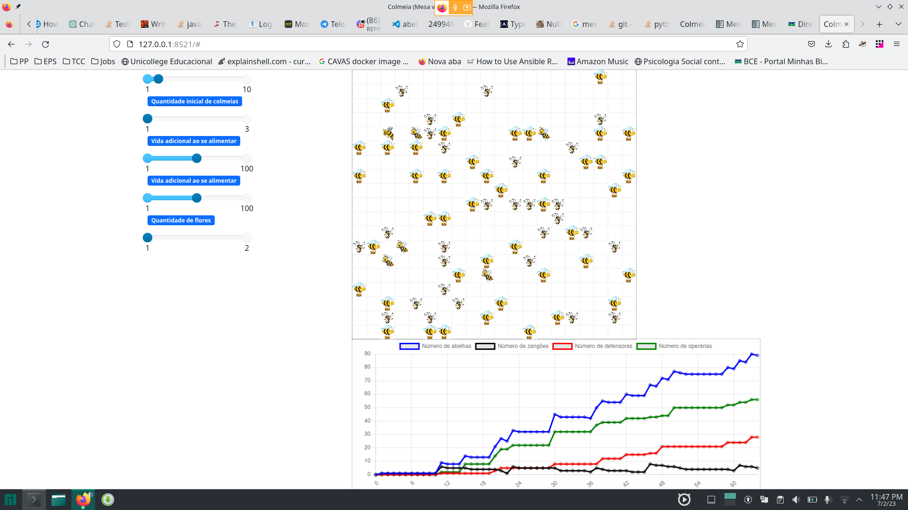

# Bee Move

**Disciplina**: FGA0210 - PARADIGMAS DE PROGRAMAÇÃO - T04 <br>
**Nro do Grupo (de acordo com a Planilha de Divisão dos Grupos)**: 03<br>
**Paradigma**: SMA<br>

## Alunos
|Matrícula | Aluno |
| -- | -- |
| Adrian Soares Lopes | 160000572 |
| Bianca Sofia Brasil de Oliveira | 190025298 |
| Daniel Vinicius Ribeiro Alves | 190026375 |
| Daniela Soares de Oliveira | 180015222 |
| Eduardo Maia Rezende | 180119231 |
| Erick Melo Vidal de Oliveira | 190027355 |
| João Victor Max Bisinotti de Oliveira | 170069991 |
| Klyssmann Henrique Ferreira de Oliveira | 202028202 |
| Mariana Oliveira Pires do Rio | 190058455 |
| Vitor Eduardo Kühl Rodrigues | 190118288 |

## Sobre 
O projeto simula o ambiente de uma colmeia, onde múltiplos agentes interagem. Os agentes incluem zangões, operárias, abelha rainha e comida (pólen de flor). Cada agente tem seu comportamento específico. Os zangões desempenham funções reprodutivas, as operárias realizam tarefas como coletar alimentos e construir favos, enquanto a abelha rainha é responsável pela reprodução e manutenção da colmeia. A comida é um recurso necessário para a sobrevivência da colmeia. A simulação permite observar a dinâmica e as interações entre os diferentes agentes no ambiente da colmeia.

## Screenshots



## Instalação 
**Linguagens**: Python v3.11 <br>
**Tecnologias**: Mesa<br>
Certifique-se de ter o pacote Mesa instalado. Se não tiver, execute o seguinte comando no terminal:
```bash
$ pip install mesa
```

## Uso 
Para rodar a simulação após a instalação do mesa, No terminal, navegue até o diretório raiz do projeto e execute o seguinte comando:
```bash
$ mesa runserver
```
Lembre-se de garantir a versão do python como `python v3.11` 
## Vídeo

https://youtu.be/eTq0qUlhdtQ

## Participações
Apresente, brevemente, como cada membro do grupo contribuiu para o projeto.
|Nome do Membro | Contribuição | Significância da Contribuição para o Projeto (Excelente/Boa/Regular/Ruim/Nula) |
| -- | -- | :-: |
| Adrian Soares Lopes | Frontend, estrutura dos agentes e organização do repositório | Excelente |
| Bianca Sofia Brasil de Oliveira | estrutura dos agentes e organização do repositório | Excelente |
| Daniel Vinicius Ribeiro Alves | Frontend, gráficos dinâmicos e organização do repositório | Excelente |
| Daniela Soares de Oliveira | estrutura dos agentes e organização repositório | Excelente |
| Eduardo Maia Rezende | Frontend, estrutura dos agentes e organização do repositórios | Excelente |
| Erick Melo Vidal de Oliveira | Frontend, estrutura dos agentes e organização do repositório | Excelente |
| João Victor Max Bisinotti de Oliveira | estrutura dos agentes e organização repositórios | Excelente |
| Klyssmann Henrique Ferreira de Oliveira | Frontend, estrutura dos agentes e organização do repositório | Excelente |
| Mariana Oliveira Pires do Rio | estrutura dos agentes e organização repositório | Excelente |
| Vitor Eduardo Kühl Rodrigues | estrutura dos agentes e organização repositório | Excelente |

## Outros 
(i) Lições Aprendidas:

Importância de pensar de forma abstrata ao projetar e interagir com agentes.
Necessidade de buscar soluções ad-hoc para resolver algumas comunicações entre os agentes.
Aprendizado sobre o comportamento dos agentes ao vê-los executando.

(ii) Percepções:

Percepção do poder dos sistemas computacionais na simulação de sistemas complexos.
Descoberta das possibilidades e aplicabilidade da abordagem de sistemas multiagentes em várias áreas.
Interesse despertado pela capacidade dos agentes autônomos em tomar decisões independentes.

(iii) Contribuições e Fragilidades:

Flexibilidade e escalabilidade proporcionadas pelo MESA, permitindo a personalização dos agentes e ambientes.
Utilização de ferramentas pré-construídas e visualização interativa em tempo real do MESA.
Dificuldades na comunicação entre os agentes e possibilidade de implementação mais robusta com um framework com protocolos mais rígidos.

(iv) Trabalhos Futuros:

Explorar mais as possibilidades do paradigma de sistemas multiagentes.
Aprofundar os estudos sobre o comportamento e interações dos agentes em simulações.
Buscar soluções para a comunicação entre os agentes de forma mais eficiente e robusta.
Continuar colaborando e compartilhando conhecimentos com a comunidade de usuários de MESA em Python

## Fontes
[A.B.E.L.H.A](https://abelha.org.br/)<br>
[Morfologia das Abelhas e Sistemas](https://pt.slideshare.net/candidoalice/morfologia-das-abelhas-e-sistemas)<br>

