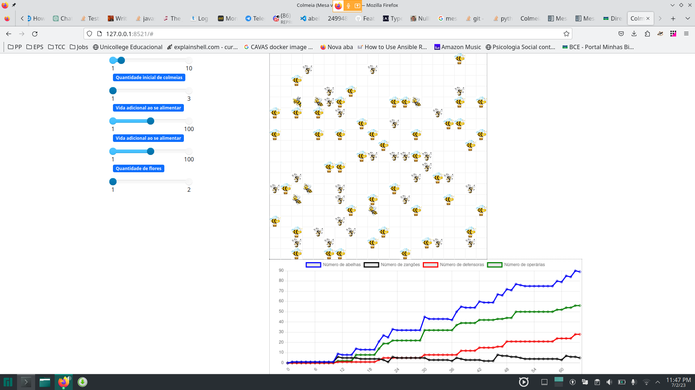

# Bee Move

**Disciplina**: FGA0210 - PARADIGMAS DE PROGRAMAÇÃO - T02 <br>
**Nro do Grupo**: 03<br>
**Paradigma**: SMA<br>

## Alunos

|Matrícula | Aluno |
| -- | -- |
| Adrian Soares Lopes | 160000572 |
| Bianca Sofia Brasil de Oliveira | 190025298 |
| Daniel Vinicius Ribeiro Alves | 190026375 |
| Daniela Soares de Oliveira | 180015222 |
| Eduardo Maia Rezende | 180119231 |
| Erick Melo Vidal de Oliveira | 190027355 |
| João Victor Max Bisinotti de Oliveira | 170069991 |
| Klyssmann Henrique Ferreira de Oliveira | 202028202 |
| Mariana Oliveira Pires do Rio | 190058455 |
| Vitor Eduardo Kühl Rodrigues | 190118288 |

## Sobre

## Screenshots


<!-- 

 -->

## Instalação

**Linguagens**: Python <br>
**Tecnologias**: mesa<br>

## Pré Requisitos

#### Instalação do Python

O download pode ser feito pelo site [python](https://www.python.org/downloads/) para a versão Windows e [python](https://python.org.br/instalacao-linux/) para o Linux

#### Gitpages localmente

```bash
npm install -g http-server
```
Na pasta docs:
```bash
http-server -c-1
```

## Uso

Deve-se primeiramente instalar a mesa `pip install mesa`

Para o rodar o projeto.

```bash
mesa runserver
```

## Vídeo
Vídeo de apresentação do projeto

[](https://www.youtube.com)
>Clique na imagem para assistir

## Participações
Apresente, brevemente, como cada membro do grupo contribuiu para o projeto.

|Nome do Membro | Contribuição | Significância da Contribuição para o Projeto (Excelente/Boa/Regular/Ruim/Nula) |
| -- | -- | -- |
| Adrian Soares Lopes | Frontend, estrutura da árvore e organização do repositório | Excelente |
| Bianca Sofia Brasil de Oliveira | Backend, estrutura da árvore e organização do repositório | Excelente |
| Daniel Vinicius Ribeiro Alves | Frontend e organização do repositório | Excelente |
| Daniela Soares de Oliveira | Backend, estrutura da árvore e organização repositório | Excelente |
| Eduardo Maia Rezende | Backend, organização do repositório e gitpages | Excelente |
| Erick Melo Vidal de Oliveira | Frontend e organização do repositório | Excelente |
| João Victor Max Bisinotti de Oliveira | Backend, Frontend e estrutura da árvore | Excelente |
| Klyssmann Henrique Ferreira de Oliveira | Backend, estrutura da árvore e organização do repositório | Excelente |
| Vitor Eduardo Kühl Rodrigues | Backend e estrutura da árvore | Excelente |

## Outros

### Lições Aprendidas:

### Percepções:

### Contribuições e Fragilidades:

### Trabalhos Futuros:

## Fontes

[A.B.EL.H.A](https://abelha.org.br/)<br>
[Morfologia das Abelhas e Sistemas](https://pt.slideshare.net/candidoalice/morfologia-das-abelhas-e-sistemas)<br>
