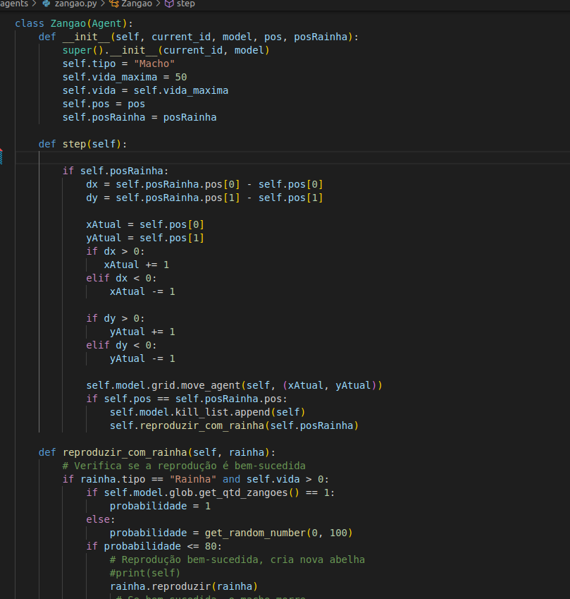
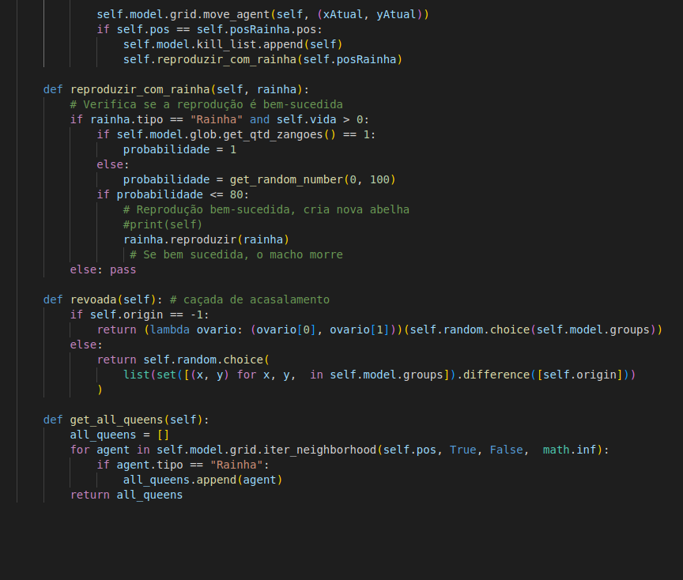
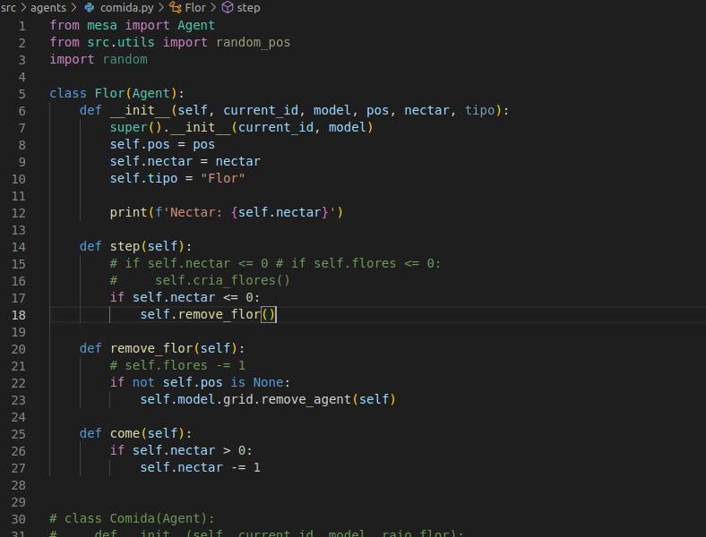

## Os agentes
### Abelha Rainha

### Zangao

O Zangao herda a classe Agent do módulo mesa. Essa classe representa um zangão em um modelo de simulação de abelhas. Sendo que ele pode reproduzir com a rainha para gerar novas abelhas.

#### Atributos:

tipo: Uma string que indica o tipo da entidade, no caso, "Macho".

vida_maxima: Representa a quantidade máxima de vida que um zangão pode ter.

vida: Representa a quantidade atual de vida do zangão.

pos: Representa a posição do zangão no modelo.

posRainha: Representa a posição da abelha rainha com a qual o zangão está interagindo.

#### Métodos:

O construtor da classe recebe um ID atual, uma instância do modelo, a posição inicial do zangão e a posição da abelha rainha. O construtor chama o construtor da classe pai (Agent) e inicializa os atributos do zangão.

O método step é chamado a cada passo da simulação. Neste caso, o zangão verifica se a posição da abelha rainha está definida. Se estiver, ele calcula o deslocamento necessário para se aproximar da abelha rainha em uma unidade no eixo x e/ou no eixo y. Em seguida, move-se para a nova posição usando o método move_agent do objeto grid do modelo. Se a posição atual do zangão coincidir com a posição da abelha rainha, ele é adicionado à lista de zangões a serem mortos e chama o método reproduzir_com_rainha para reproduzir com a abelha rainha.

reproduzir_com_rainha(self, rainha): Verifica se a reprodução com a abelha rainha é bem-sucedida com base em uma probabilidade. Se for, a abelha rainha é instruída a se reproduzir, resultando na criação de uma nova abelha. Se a reprodução for bem-sucedida, o zangão morre.

get_all_queens(self): Retorna uma lista de todas as abelhas rainhas nas proximidades do zangão, com base na verificação da vizinhança da grade.

#### Código

### Operaria

### Flor

A classe Flor herda a classe Agent do módulo mesa. Essa classe representa uma flor em um modelo de simulação. Sendo que representa o alimento da abelha rainha, fornecendo o nectar.

##### Atributos:

pos: Representa a posição da flor no modelo. Pode ser uma coordenada (x, y) ou outro formato de representação de posição.

nectar: Representa a quantidade de néctar da flor.

tipo: Uma string que indica o tipo da entidade, no caso, "Flor".

##### Métodos:

O construtor da classe recebe um ID atual, uma instância do modelo, a posição da flor, a quantidade inicial de néctar e o tipo da flor. O construtor chama o construtor da classe pai (Agent) e inicializa os atributos da flor.

O método step() é chamado a cada passo da simulação. Neste caso, ele verifica se a quantidade de néctar da flor é menor ou igual a zero e, caso seja verdadeiro, chama o método remove_flor para remover a flor do modelo.

O método remove_flor() remove a flor do modelo chamando o método remove_agent do objeto grid do modelo, se a posição da flor não for None.

O método come() diminui a quantidade de néctar da flor em uma unidade.

##### Código: 

### Model

### Graficos
