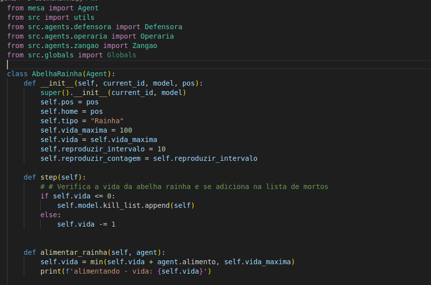
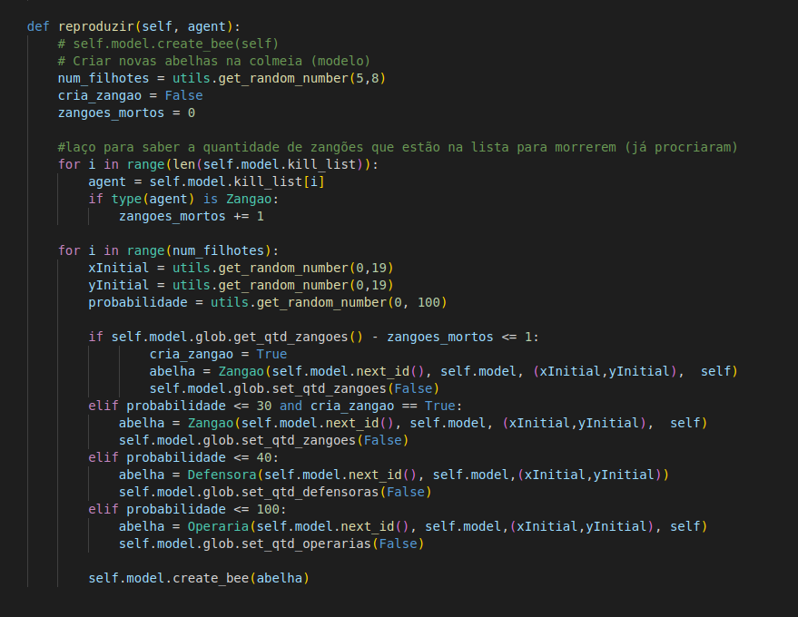
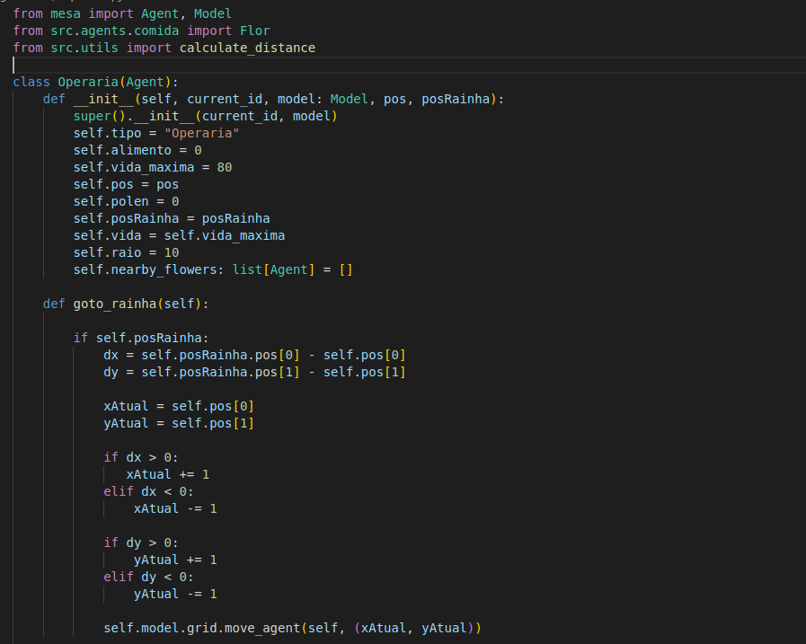
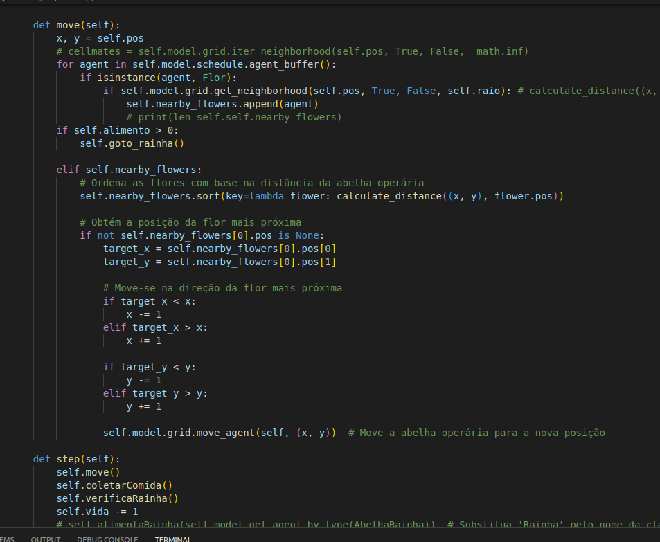
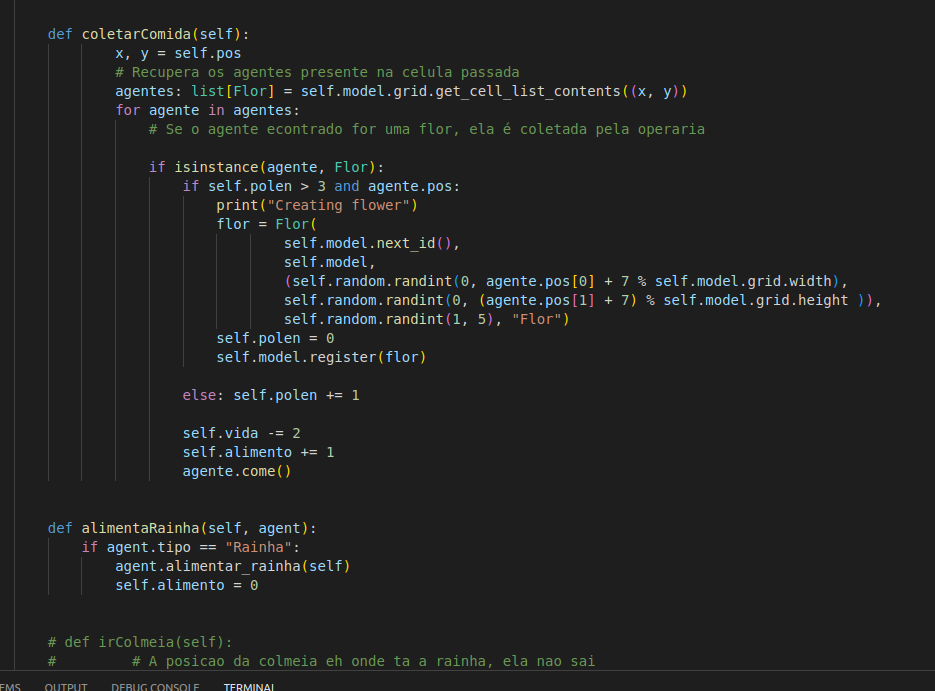

## Os agentes
### Abelha Rainha

A classe AbelhaRainha herda a classe Agent do módulo mesa. Ela representa uma abelha rainha em um modelo de simulação de abelhas. Essa abelha tem a responsabilidade de reproduzir e aumentar a colmeia.

#### Atributos:

pos: Representa a posição da abelha rainha no modelo.

home: Representa a posição inicial da abelha rainha.

tipo: Uma string que indica o tipo da entidade, no caso, "Rainha".

vida_maxima: Representa a quantidade máxima de vida que a abelha rainha pode ter.

vida: Representa a quantidade atual de vida da abelha rainha.

reproduzir_intervalo: Representa o intervalo de tempo em que a abelha rainha pode se reproduzir.

reproduzir_contagem: Contagem regressiva para a próxima reprodução da abelha rainha.

#### Métodos:

 O construtor da classe recebe um ID atual, uma instância do modelo e a posição inicial da abelha rainha. O construtor chama o construtor da classe pai (Agent) e inicializa os atributos da abelha rainha.

O método step é chamado a cada passo da simulação. Neste caso, ele verifica a vida da abelha rainha. Se a vida for menor ou igual a zero, a abelha rainha é adicionada à lista de entidades a serem mortas. Caso contrário, a vida é reduzida em uma unidade.

alimentar_rainha(self, agent): Aumenta a vida da abelha rainha em uma quantidade igual à quantidade de alimento do agente fornecido.

reproduzir(self, agent): Cria novas abelhas no modelo com base em uma probabilidade. O número de filhotes a serem criados é definido aleatoriamente entre 5 e 8. A probabilidade de criar um zangão, uma defensora ou uma operária é definida com base em faixas de probabilidade. As abelhas recém-criadas são adicionadas ao modelo chamando o método create_bee do modelo.

#### Código

### Zangao

O Zangao herda a classe Agent do módulo mesa. Essa classe representa um zangão em um modelo de simulação de abelhas. Sendo que ele pode reproduzir com a rainha para gerar novas abelhas.

#### Atributos:

tipo: Uma string que indica o tipo da entidade, no caso, "Macho".

vida_maxima: Representa a quantidade máxima de vida que um zangão pode ter.

vida: Representa a quantidade atual de vida do zangão.

pos: Representa a posição do zangão no modelo.

posRainha: Representa a posição da abelha rainha com a qual o zangão está interagindo.

#### Métodos:

O construtor da classe recebe um ID atual, uma instância do modelo, a posição inicial do zangão e a posição da abelha rainha. O construtor chama o construtor da classe pai (Agent) e inicializa os atributos do zangão.

O método step é chamado a cada passo da simulação. Neste caso, o zangão verifica se a posição da abelha rainha está definida. Se estiver, ele calcula o deslocamento necessário para se aproximar da abelha rainha em uma unidade no eixo x e/ou no eixo y. Em seguida, move-se para a nova posição usando o método move_agent do objeto grid do modelo. Se a posição atual do zangão coincidir com a posição da abelha rainha, ele é adicionado à lista de zangões a serem mortos e chama o método reproduzir_com_rainha para reproduzir com a abelha rainha.

reproduzir_com_rainha(self, rainha): Verifica se a reprodução com a abelha rainha é bem-sucedida com base em uma probabilidade. Se for, a abelha rainha é instruída a se reproduzir, resultando na criação de uma nova abelha. Se a reprodução for bem-sucedida, o zangão morre.

get_all_queens(self): Retorna uma lista de todas as abelhas rainhas nas proximidades do zangão, com base na verificação da vizinhança da grade.

#### Código

### Flor

A classe Flor herda a classe Agent do módulo mesa. Essa classe representa uma flor em um modelo de simulação. Sendo que representa o alimento da abelha rainha, fornecendo o nectar.

##### Atributos:

pos: Representa a posição da flor no modelo. Pode ser uma coordenada (x, y) ou outro formato de representação de posição.

nectar: Representa a quantidade de néctar da flor.

tipo: Uma string que indica o tipo da entidade, no caso, "Flor".

##### Métodos:

O construtor da classe recebe um ID atual, uma instância do modelo, a posição da flor, a quantidade inicial de néctar e o tipo da flor. O construtor chama o construtor da classe pai (Agent) e inicializa os atributos da flor.

O método step() é chamado a cada passo da simulação. Neste caso, ele verifica se a quantidade de néctar da flor é menor ou igual a zero e, caso seja verdadeiro, chama o método remove_flor para remover a flor do modelo.

O método remove_flor() remove a flor do modelo chamando o método remove_agent do objeto grid do modelo, se a posição da flor não for None.

O método come() diminui a quantidade de néctar da flor em uma unidade.

##### Código: 

### Operaria
A classe Operaria herda a classe Agent do módulo mesa. Ela representa uma abelha operária em um modelo de simulação de abelhas. Sendo que possui a responsabilidade de alimentar a rainha e polinizar as flores.

#### Atributos:

tipo: Uma string que indica o tipo da entidade, no caso, "Operaria".

alimento: A quantidade de alimento que a abelha operária possui.

vida_maxima: Representa a quantidade máxima de vida que a abelha operária pode ter.

pos: Representa a posição da abelha operária no modelo.

polen: A quantidade de pólen coletada pela abelha operária.

posRainha: A posição da abelha rainha.

vida: A quantidade atual de vida da abelha operária.

raio: O raio de alcance em que a abelha operária pode detectar flores próximas.

nearby_flowers: Uma lista de flores próximas à abelha operária.

#### Métodos
O construtor da classe recebe um ID atual, uma instância do modelo, a posição inicial da abelha operária e a posição da abelha rainha. O construtor chama o construtor da classe pai (Agent) e inicializa os atributos da abelha operária.

goto_rainha(self): Move a abelha operária em direção à abelha rainha. A abelha operária tenta se aproximar da posição da abelha rainha, movendo-se em direção a ela com base nas diferenças entre as coordenadas x e y.

move(self): Controla o movimento da abelha operária. A abelha operária verifica se existem flores próximas usando o raio de alcance. Se houver flores próximas, elas são adicionadas à lista nearby_flowers. Se a abelha operária tiver alimento suficiente, ela se move em direção à abelha rainha chamando o método goto_rainha(). Caso contrário, a abelha operária seleciona a flor mais próxima com base na distância e se move em direção a ela.

step(self): O método step é chamado a cada passo da simulação. Neste caso, ele chama os métodos move(), coletarComida(), verificaRainha() e reduz a vida da abelha operária em uma unidade.

verificaRainha(self): Verifica se a abelha operária está na mesma célula da abelha rainha. Se estiver, ela chama o método alimentaRainha() para alimentar a rainha.

coletarComida(self): Coleta comida das flores próximas. A abelha operária verifica as flores presentes na mesma célula e as coleta se tiver espaço para armazenamento. A vida da abelha operária é reduzida e o alimento e o pólen são incrementados. Se a abelha operária tiver pólen suficiente, ela cria uma nova flor aleatoriamente nas proximidades.

alimentaRainha(self, agent): Alimenta a abelha rainha. Se o agente fornecido for uma abelha rainha, o método alimentar_rainha() da abelha rainha é chamado e o alimento da abelha operária é zerado.

#### Código

### Model

### Graficos
