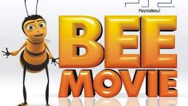
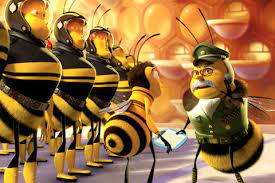
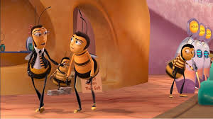
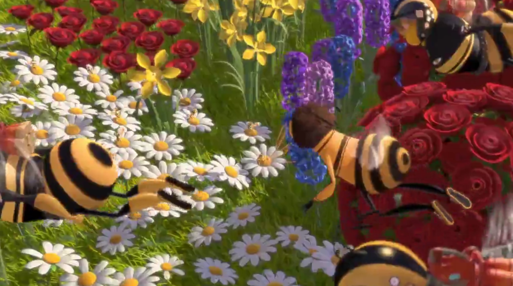
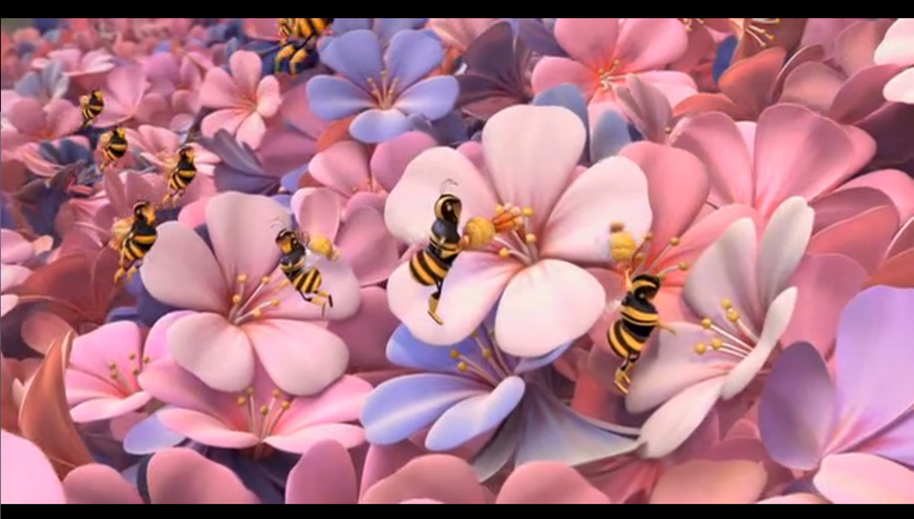

## História

<!--  -->

Era uma vez, uma colmeia que viviam as abelhas, cada uma com seu papel bem definido. Havia a imponente rainha, cuja função principal era assegurar a reprodução da colônia. Os zangões, abelhas masculinas, tinham como objetivo criar outras abelhas com a rainha. As operárias eram incansáveis, trabalhando arduamente para coletar néctar das flores e trazê-lo de volta à colmeia. E, por fim, as defensoras, que dedicavam-se a proteger a colmeia de ameaças externas.

 

Todos os dias, o sol iluminava os arredores da colmeia, enchendo-o com cores vibrantes e perfumes doces. As operárias saíam em grupos organizados, voando de flor em flor, polinizando-as e coletando o néctar precioso. Enquanto isso, os zangões aguardavam ansiosamente o momento de se encontrar com a rainha para fecundá-la e assegurar a continuação da colônia.

Porém, um dia, a harmonia foi abalada por uma ameaça inesperada. Uma tempestade poderosa atingiu a área circundante, destruindo muitas das flores que forneciam néctar para a colmeia. Sem néctar suficiente, a colônia começou a enfrentar escassez de alimento e perigo iminente.

Barry, uma abelha operária esperta e curiosa, percebeu que algo precisava ser feito para garantir a sobrevivência de sua colônia. Reunindo todas as abelhas disponíveis, incluindo as defensoras, ele liderou uma expedição fora da colmeia em busca de uma solução para a crise.

.jpeg)

Enquanto exploravam os arredores, Barry e suas companheiras depararam-se com um jardim secreto escondido na floresta. Este jardim era protegido por um grupo de abelhas operárias que, de alguma forma, conseguiram encontrar flores abundantes e saudáveis mesmo após a tempestade. Inspirado por sua descoberta, Barry decidiu pedir ajuda a essas abelhas misteriosas.

.jpeg)

Ao se aproximarem do jardim, eles foram recebidos pelas abelhas guardiãs. Berry então explicou a situação e as abelhas misteriosas decidiram ajudar. Juntas, as abelhas da colmeia e as abelhas do jardim formaram uma equipe unida, trabalhando em cooperação para superar a escassez de alimento. As operárias do jardim compartilharam seus conhecimentos sobre as melhores flores para coletar néctar, enquanto as abelhas da colmeia trouxeram sua experiência em construção de favos e organização eficiente do trabalho. Juntas, elas conseguiram estabelecer um sistema de compartilhamento de recursos, onde as abelhas da colmeia coletavam néctar no jardim e as abelhas guardiãs continuavam protegendo o local.

Enquanto trabalhavam lado a lado, as abelhas desenvolveram uma relação de amizade e compartilhamento de conhecimentos. Durante as pausas para descanso, elas contavam histórias engraçadas e trocavam piadas, criando um ambiente divertido e animado.

Enquanto isso, as defensoras continuavam seu trabalho incansável de proteção da colmeia. Elas construíram fortificações adicionais, reforçaram as defesas e estabeleceram uma comunicação eficiente com as abelhas do jardim para alertá-las sobre qualquer perigo iminente.

Com o passar do tempo, a colônia começou a se recuperar da crise. O néctar coletado no jardim secreto era abundante e nutritivo, proporcionando energia suficiente para a colmeia prosperar. As abelhas trabalhavam em perfeita sintonia, desempenhando suas funções de maneira exemplar e garantindo a sobrevivência de sua comunidade.
